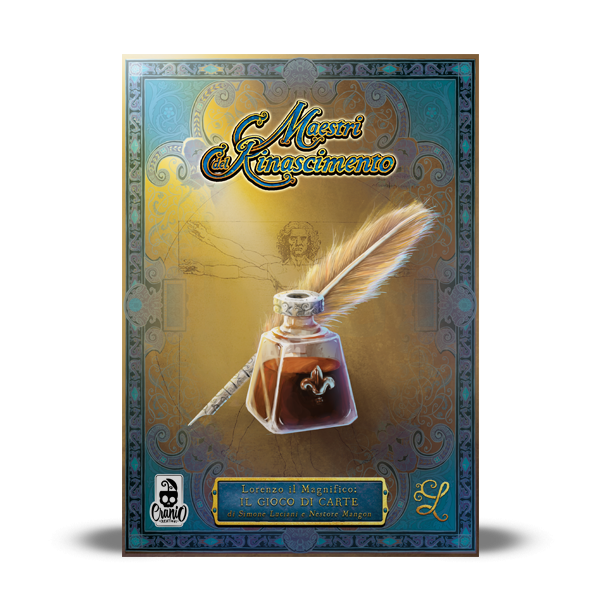

# Prova finale d' Ingegneria del Software, AA 2020/2021


La prova finale consiste nell' implementazione del gioco da tavolo [Maestri del Rinascimento](http://www.craniocreations.it/prodotto/masters-of-renaissance/).
Il progetto prevede l' utilizzo di un' architettura client-server con un singolo server centrale al quale i vari client potranno connettersi
tramtite socket.
Tutto il progetto sfrutta l' architettura MVC (Model-View-Controller)

## Funzionalità
Sono state implementate:
- Regole complete
- CLI
- GUI
- Socket
- 1 Funzionalità Avanzata (FA):
  - **Partite multiple**: il server è in grado di gestire più partite contemporaneamente.
    All' accesso al server ai giocatori viene richiesto se desiderano creare una nuova partita oppure unirsi
    a una già esistente. Nel primo caso sarà richiesto il numero di giocatori e poi verrà fornito un ID univoco
    per la partita che gli altri giocatori che si uniranno dovranno inserire; se invece un giocatore
    desidera unirsi a una partita già esistente dovrà inserire l'ID della stessa.
    Ogni partita inizia solo quando tutti i giocatori sono connessi.

## Strumenti utilizzati
Per la realizzazione del progetto sono stati utilizzati vari strumenti software:

|Software|Descrizione|
|-------------|-----|
|IntelliJ IDEA| IDE scritto in Java sviluppato da JetBrains|
|[Apache Maven](https://maven.apache.org)|Strumento di build automation e gestione di progetti software basati su Java |
|JavaFX|Libreria grafica utilizzata da Java per la realizzazione di interfacce utente|
|JUnit|Framework per il test di unità (integrato in IntelliJ) |


## Avvio del gioco
Per poter utilizzare il gioco correttamente sono consigliate versioni di java 8.x o superiori.

### Client
Il client potrà essere avviato sia in modalità GUI (Graphical User Interface) che CLI (Command Line Interface).
Per lanciare il client tramite terminale è necessario recarsi nella cartella contenente il file jar
e digitare:
``` 
java -jar Client.jar
```
Di default sarà selezionata la modalità CLI.
Se invece si desidera avviare l' interfaccia grafica si dovrà inserire un apposito parametro:
```
java -jar Client.jar --gui
```
Il client può essere lanciato anche cliccando due volte sull' icona dell' applicazione, in tal caso
sarà avviata la modalità GUI.
### Server
Il server non possiede interfaccia grafica o da linea di comando. Per lanciarlo è necessario
posizionarsi nella cartella contenente il jar e utilizzare il comando:
```
java -jar Server.jar <portNumber>
```
Il programma partirà e sarà eseguito in background sulla porta selezionata. 
Di default si avrà ``portNumber = 10000``. Se verranno forniti parametri sbagliati il server non partirà
ma mostrerà un messaggio di errore che invita a utilizzare il parametro ``-h`` per ricevere aiuto.


## Componenti del gruppo
- **[Luca Molteni](https://github.com/molteniluca)**
- **[Manuel Montecalvo](https://github.com/ManuelMontecalvo)**
- **[Francesco Minnucci](https://github.com/FrancescoMinnucci)**
